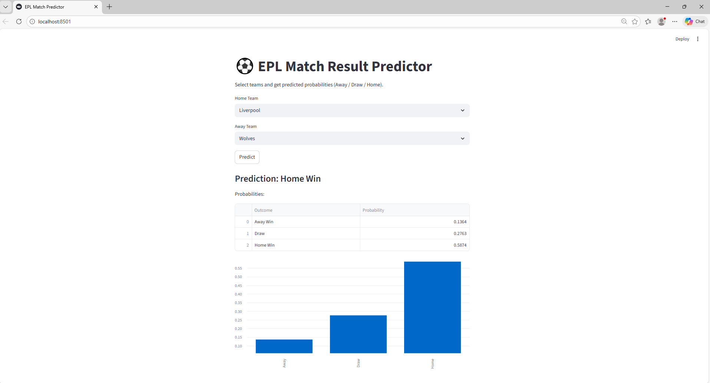

# ⚽ EPL Match Result Predictor

An end-to-end machine learning project that predicts **Premier League match outcomes**
(**Home / Draw / Away**) using historical match data.



The project focuses on building a **realistic, leakage-free ML pipeline** and a usable
prediction interface.

---

## 🚀 Features
- Data analysis on 9,000+ EPL matches (2000–2025)
- Leakage-free feature engineering using rolling team form
- Time-aware train/test splitting
- Machine learning models:
  - Logistic Regression
  - Random Forest
- Model persistence (saved artifacts)
- Interactive **Streamlit web app** for predictions

----

## 🧠 Machine Learning Approach
- Target: Match result (Away / Draw / Home)
- Features:
  - Home & away rolling goal averages
  - Defensive form
  - Matches played (experience)
- Evaluation:
  - Chronological train/test split
  - Confusion matrices & classification reports

---

## 🖥️ Streamlit App
The app allows users to:
- Select **Home Team** and **Away Team**
- Get predicted probabilities for each outcome
- Visualize confidence via bar charts

> Example:
> Arsenal vs Man City → P(Home) / P(Draw) / P(Away)

---

## 📂 Project Structure
epl-match-prediction/
├── app.py
├── data/
├── notebooks/
├── src/
├── artifacts/
└── README.md


---

## 🛠️ Tech Stack
- Python
- Pandas, NumPy
- Scikit-learn
- Streamlit
- Matplotlib, Seaborn

---

## ▶️ How to Run Locally

```bash
# Create virtual environment
python -m venv .venv
source .venv/bin/activate  # Windows: .venv\Scripts\Activate.ps1

# Install dependencies
pip install -r requirements.txt

# Run the app
streamlit run app.py
